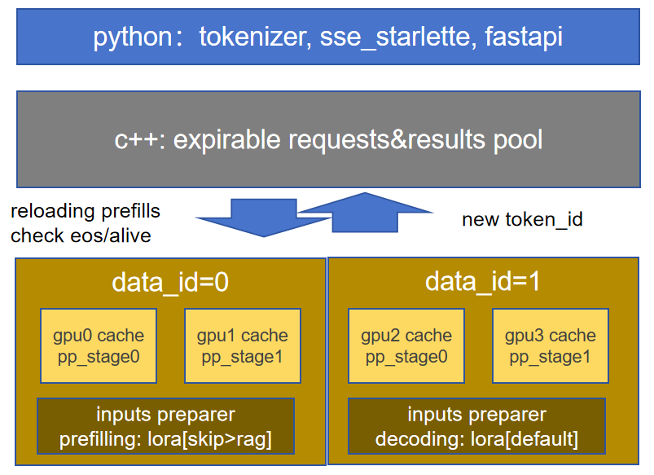
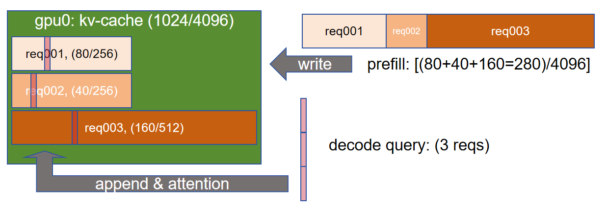

# qwen inference accelerate
qwen 14b chat int4 gptq inference accelerated for V100 16G

# 推理加速框架说明

### 模型支持
master代码仅针对qwen1.5-14b-chat-int4-gptq进行的推理加速，如果更换模型或是量化，需要修改`src/generate.cpp`以及`src/forward_gpu.cu`，涉及模型参数名、激活函数选择，以及linear层的量化选择。每次模型更换或layer更新，都需要修改代码并进行数值验证。

理论支持任意transformers架构下 `channels=hidden_size/num_attention_heads = 128`的非moe模型。

模型加载完全本地化，具体参照`serving/liteqwen_inferer.py`,使用了本地路径`qwen2/`下python模型代码版本的tokenizer和config，以及`scripts/liteqwen_py/connector.py`下加载了`configuration.json`配置的本地路径模型`.bin`或`.safetensor`文件。**注意：如果你使用的是`2024-03-26`之后下载的模型文件，需要检查你的版本的qwen模型的`config.json`。新旧参数权重不同，且`intermediate_size`数值也不同。需要确认你的本地模型的`intermediate_size`与项目路径`qwen2/config.json`中的数值一致。**。

不支持按照模型名/id从互联网下载，避免模型版本变动。
可以本地python推理`scripts/try_console_inf.py`验证模型的pytorch推理结果。

peft版本0.4.0之后，需要注意lora模型的`adapter_config.json`中`"use_rslora": false`参数，需要为`false`才能推理结果正确。如果为true，lora scale计算时需要增加sqrt操作，需要修改`src/forward_gpu.cu`里的对应方法。

### 推理性能对比
条件：单卡v100，16并发，input token数44，平均reply字符数235，max_sequence_length(max-model-len)=4096。无加载lora

vllm吞吐量：419字符/秒，显存占用29.5G

liteqwen吞吐量：204字符/秒，显存占用12.9G

吞吐量仍存在一定差距，但vllm应该是使用了更大的推理batch，所以activation占用较多。Liteqwen兼顾了显存优化，在加载lora后也能保证16G显存推理。

### 样本batch分割
基于continuous batch进行的llm推理加速，flash attention使用cutlass_fmha计算prefill阶段的attention；decode attention是自主实现的算子（参考了falsh attention）。量化使用exllama的gptq linear。支持lora切换，会将请求按照时间顺序切分batch，遇到新请求的lora改变，或已经拼接到max_batch_size，或kv-cache缓存剩余空间无法容纳新请求的max_length时，会暂停请求的reload，推理当前batch。当前batch内任意样本完结后恢复新样本reload过程。

与vllm的page attention不同，liteqwen需要预估每个请求的max_length，
正确的使用方式是：
**1. 尽量给每条请求足够用且尽可能小的max_length**

**2. 尽量让相同lora的请求在时间轴上靠近**

这样才能尽量增加推理时的batch_size，避免频繁batch分割，实现更高吞吐量。
如果计算不清楚`max_length`，也可以使用`max_new_tokens`参数替代，如果两个参数都不提供，默认使用模型支持的最大长度进行推理，推理吞吐量回到`batch_size=1`的情况，损失较大。

### 启动方法
首先检查pytorch, transformers, peft是否已经安装好。
之后使用cmake build安装推理加速服务，运行`run_install.sh`脚本。

安装完成后修改`configuration.json`，检查模型路径、lora配置，以及端口号。

修改完配置，直接启动的话运行`python start_server.py`
也可以`nohup python daemon_start_server.py &`，后台守护运行启动脚本时，会自动根据`nvidia-smi`脚本的显存占用比例，判定服务是否正常。一般服务挂了的话，显存占用会归零，被检测到后，`daemon_start_server.py`会自动运行进程清理`clean_proc.sh`，之后重启服务。

服务启动好之后，可以运行`mock_cli.py`测试一下接口调用的吞吐量或生成内容。
修改开头的 
```
LOCAL_URL = "http://127.0.0.1:8081"
PARALLEL_NUM = 16
ROUND_NUM = 5
```
修改并发，之后修改`stream_post(...)`方法内的请求体，以及最后的`__main__`下的调用方式。

运行`python mock_cli.py`可以执行模拟client端调用。

`start_web.py`能够启动一个简易网页对话，端口在`configuration.json`中配置，一般服务端不使用。

请求体格式可以参照`python mock_cli.py`里，也可以查看`scripts/liteqwen_py/connector.py`、`serving/app.py`以及`serving/liteqwen_inferer.py`。目前`return_logits`参数暂未实装。

### 实现设计
模型大致架构如下：


顶层是python web框架封装，调用c++ lib，lib内包含存储输入与输出结果的池，各data_id线程负责data parallel推理。KV缓存按照pipeline parallel的stage分别存储在不同GPU，模型参数也按照layer切分策略平摊到pipeline_parallel_size张gpu上。目前没有做pipeline parallel的interleaving推理，这样意味着kv-cache与activation都会显著增加。不适合v100 16G这种算力还行但显存不足的卡。

tensor parallel推理目前也不支持，量化+tp需要大量修改，以后有需求时才考虑。

模型参数加载完成后会执行一次warmup推理，进行预分配，以及验证是否有足够显存推理当前max_length。warmup默认使用lora配置的第一个模型，**所以尽量把r=lora rank最大的模型放到第一个lora**。

每个dp线程从池中加载新请求，在InputPreparer类中更新forward所需的入参。根据batch分割策略，确定当前是插入新prefill还是继续之前的decode。prefill与decode使用的预分配显存不同，所以比起bsz=1的推理，消耗的activation显存会增加。此外，lora在batch推理时也需要更多activation显存，导致了支持的max_length下降。

当lora满足切换条件时，所有之前的decode请求都已经完成，新的prefill即将被执行，这时会执行BigBuffer显存的清理。因为lora rank可能改变，导致预分配方案发生改变。如果不清理BigBuffer，在预分配大小不匹配，无法命中activation cache时，会执行新cudaMalloc，消耗更多显存。

显存预分配管理是推理加速的核心机制之一，需要尽量保证相同用途的activation，大小尽量一致且不发生踩踏。例如每一层的attention score都按照最大长度申请，就可以反复命中同一个buffer，实现复用，节省显存malloc和free的时间。

Attention为了节约显存，会在提交样本请求时就在KV-cache中按照该样本预估的max_length或max_new_tokens声明显存。之后所有新增的decode kv，都在这块预分配的kv-cache后增量写入。由于continuous batch的activation是样本间无gap的contiguous数据，任何涉及到动态长度改变的步骤（rotary和attention）都需要对算子内的位置映射进行修改。于是出于算子融合和节约activation显存的考虑，自己实现了这些算子。最终continuous batch下的kv cache方案如下图：



样例中kv-cache最大长度4096，可以推一条`max_length=4096`的样本，也可以推`256+256+512=1024`的三条样本或更多。当前3条样本的prefill长度总共`80+40+160=280`远不到4096，所以连续拼接后的kernel启动数量一般是最少的，没有kernel启动后发现自己在padding位置上，啥都不干就退出kernel。之后decode阶段时，增量key和value会被写入kv-cache内的对应位置，之后在每个样本的kv-cache起点开始计算flash attention，直到batch内的`max(example_lengths)=161(160prefill+1decode)`

### 测试模块
将`CmakeLists.txt`的内容替换为`CMakeLists_for_test_bkup.txt`里的测试cmake脚本

修改`src/test_main.cpp`的内容，之后运行`run_test.sh`

即可测试各模块是否正常工作，也可以用于数值debug调试。

flash attention相关代码位于`src/cutlass_fmha`下，对原本的pytorch调用cutlass的方法做了一些修改。未修改版本的代码在`src/cutlass_fmha/unused_bkups`下。

exllama相关代码位于`src/exllama`。